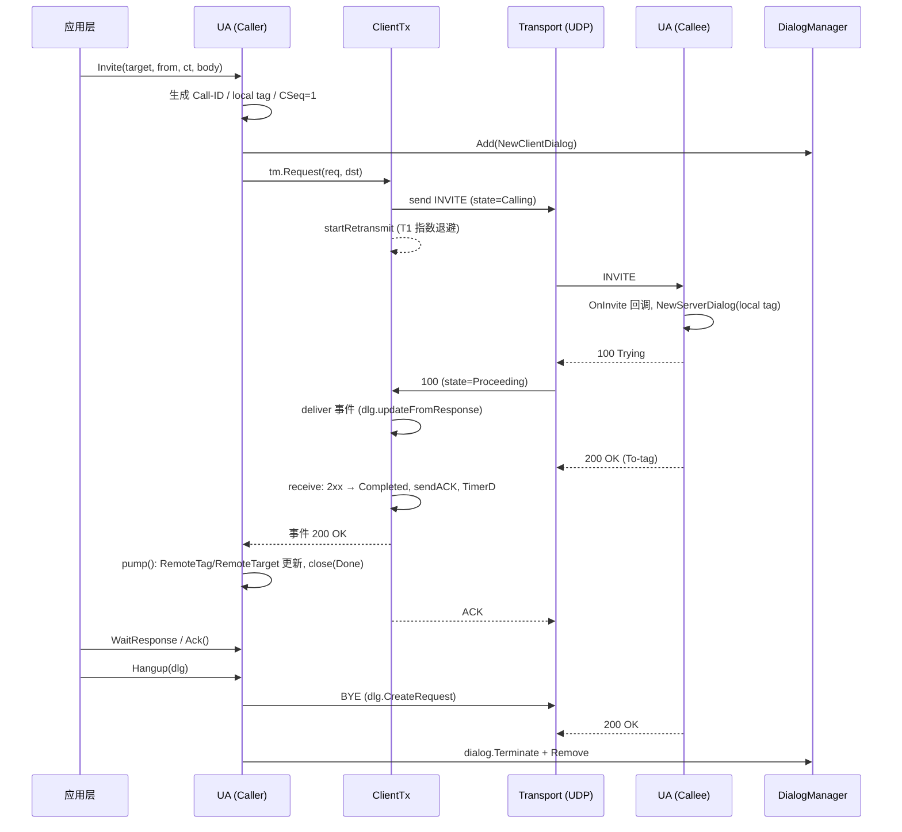
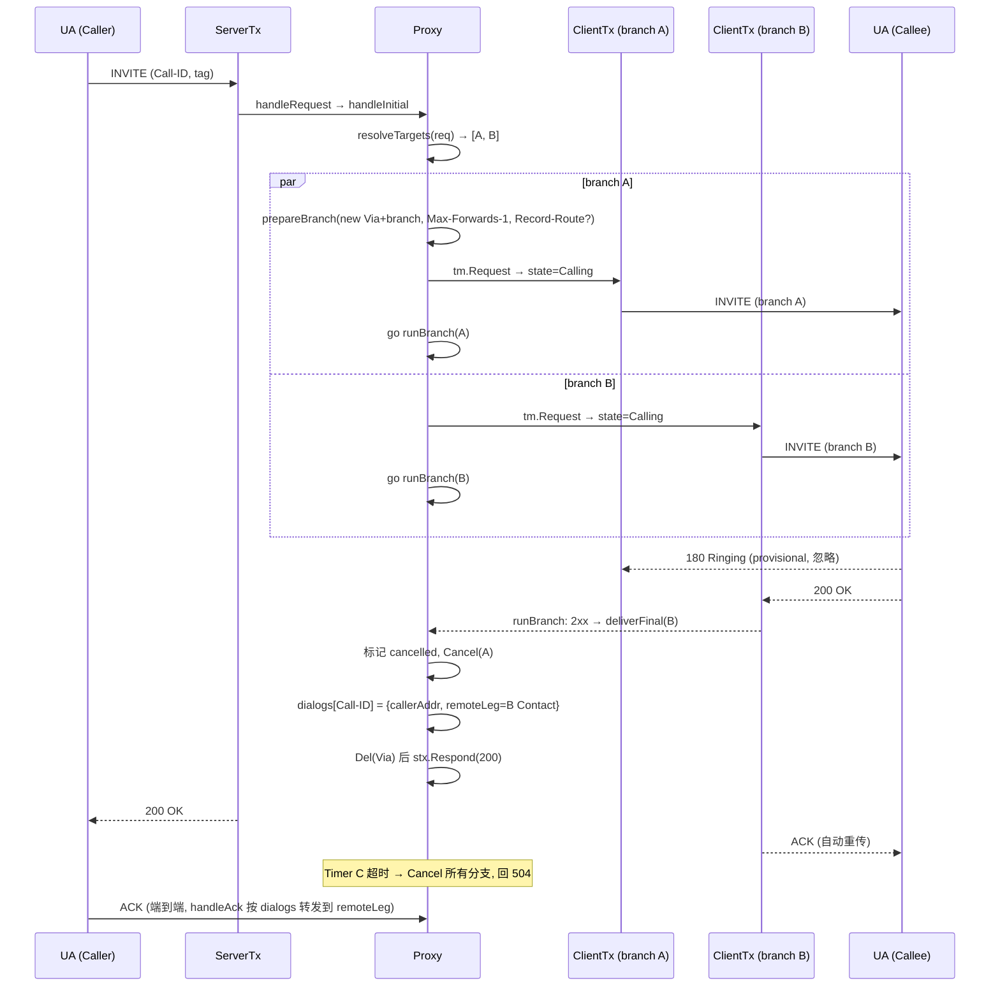
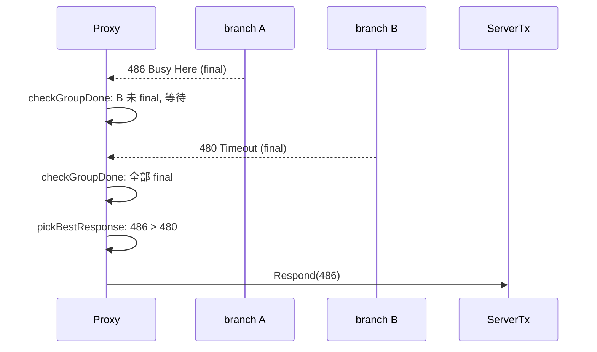
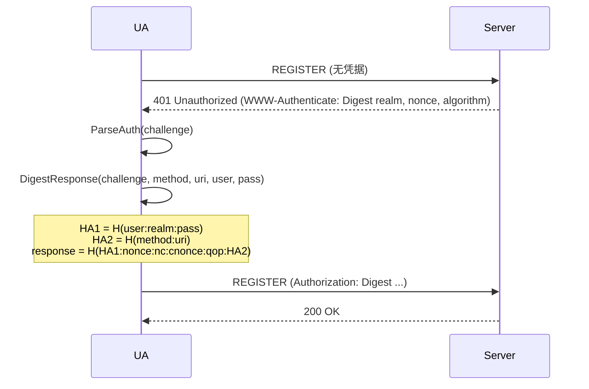

# 交互时序图

本文档描述 `go-sip` 库核心场景的消息交互时序。所有图使用 Mermaid 语法。

## 目录

- [客户端 INVITE 建立通话（UAC ↔ UAS）](#客户端-invite-建立通话)
- [代理并行 fork INVITE](#代理并行-fork-invite)
- [代理对话内请求（INFO / BYE）](#代理对话内请求)
- [CANCEL 取消呼叫](#cancel-取消呼叫)
- [REGISTER 注册流程](#register-注册流程)
- [Digest 鉴权](#digest-鉴权)
- [INVITE 事务状态机](#invite-事务状态机)

---

## 客户端 INVITE 建立通话

UAC 通过 `UA.Invite` 发起，`ClientTx` 负责重传与超时，2xx 后自动建立 Dialog。



---

## 代理并行 fork INVITE

`Proxy.handleInitial` 对初始 INVITE 按 `ResolveTargets` 返回的目标并行 fork，
第一个 2xx 胜出并取消其余分支；全部失败则按 `pickBestResponse` 转发最优失败码。



### 失败聚合



---

## 代理对话内请求

对话内请求（INFO / BYE 等）只按 Call-ID 匹配 dialog，并校验来源地址属于任一 leg（防伪造 BYE）。

```mermaid
sequenceDiagram
    participant UA as UA (Caller)
    participant STX as ServerTx
    participant P as Proxy
    participant CAL as Callee

    UA->>STX: INFO (Call-ID, 对话内)
    STX->>P: handleRequest → handleInitial → forwardInDialog
    P->>P: dialogs[Call-ID] 存在?
    P->>P: dialogSourceAllowed(src ∈ {callerAddr, remoteLeg})?
    alt 来源非法
        P-->>UA: 403 Forbidden
    else 来源合法
        P->>P: prepareBranch(new top Via+branch)
        P->>CAL: INFO → forwardAndCollect (60s)
        CAL-->>P: 200 OK
        P-->>UA: 200 OK
    end

    Note over P,BYE: BYE 成功转发后删除 dialog
    Note over P: 来源不匹配 → 403; dialog 不存在 → 481
```

---

## CANCEL 取消呼叫

CANCEL 必须与被取消的 INVITE 来自同一地址（RFC 3261 §9.1），否则在事务层直接丢弃。

```mermaid
sequenceDiagram
    participant UAC as UA (Caller)
    participant TM as TxManager (Proxy)
    participant P as Proxy
    participant CTX as ClientTx (branch)
    participant CAL as Callee

    UAC->>TM: INVITE (branch=z1)
    TM->>P: stx(INVITE) 创建
    UAC->>TM: CANCEL (branch=z1, 同一来源)
    TM->>TM: 校验 sameAddr(src, INVITE stx.src)
    TM->>P: handleRequest(CANCEL)
    P->>P: cancelled[group]=true; Cancel 所有未 final 分支
    P-->>UAC: 200 OK (CANCEL)
    CTX->>CAL: CANCEL (state=Proceeding)
    CAL-->>CTX: 487 Request Terminated
    CTX-->>P: 487 → deliverFinal/checkGroupDone → 转发上游
    P-->>UAC: 487 (INVITE)

    Note over TM: 来源不符的 CANCEL → 静默丢弃 (防拆线攻击)
```

---

## REGISTER 注册流程

代理默认拒绝转发 REGISTER（防开放中继），UA 侧由 `OnRegister` 回调处理。

```mermaid
sequenceDiagram
    participant App as 应用层
    participant UA as UA
    participant TP as Transport
    participant SRV as Registrar/Proxy

    App->>UA: Register(aor, contact, expires, creds)
    UA->>UA: Call-ID, CSeq=1 REGISTER, From tag, Expires/Contact
    UA->>TP: REGISTER → aor.Host:aor.EffectivePort()
    TP->>SRV: REGISTER
    alt 代理收到 REGISTER
        SRV-->>TP: 403 Forbidden (RelayRegister=false)
    else Registrar 收到 (UA 场景 OnRegister 回调)
        SRV-->>TP: 200 OK (Contact;expires)
        TP-->>UA: 200 OK
    end
```

---

## Digest 鉴权

收到 401/407 后用挑战构造 Digest 响应；算法支持 MD5（默认）、SHA-256、SHA-512-256（RFC 8760）。



---

## INVITE 事务状态机

客户端 INVITE 事务（含自动 ACK 与重传终止条件）。

```mermaid
stateDiagram-v2
    [*] --> Calling: tm.Request / send INVITE
    Calling --> Calling: 重传 (T1, 2×T1 上限)
    Calling --> Proceeding: 1xx
    Calling --> Completed: 2xx → sendACK, TimerD
    Calling --> [*]: TimerF 超时
    Proceeding --> Completed: 2xx → sendACK, TimerD
    Completed --> Confirmed: ACK (server 侧)
    Completed --> Terminated: TimerD
    Confirmed --> Terminated: TimerJ
    Terminated --> [*]

    note right of Calling: 非 INVITE 事务:<br/>Trying → Proceeding → Completed (T1×64 上限重传)
```
